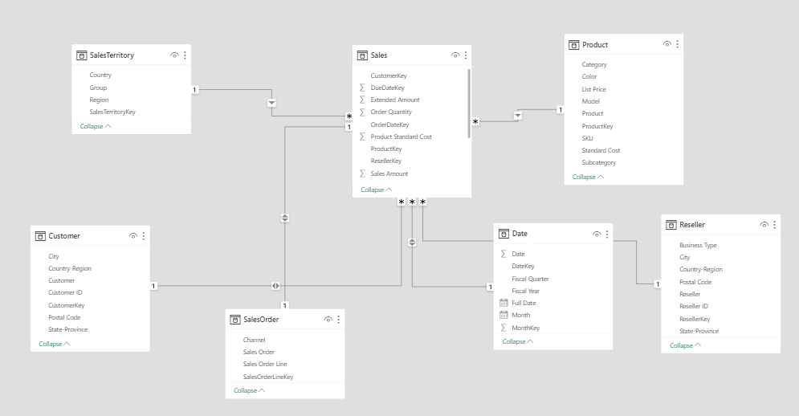
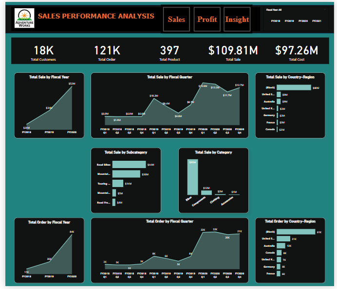
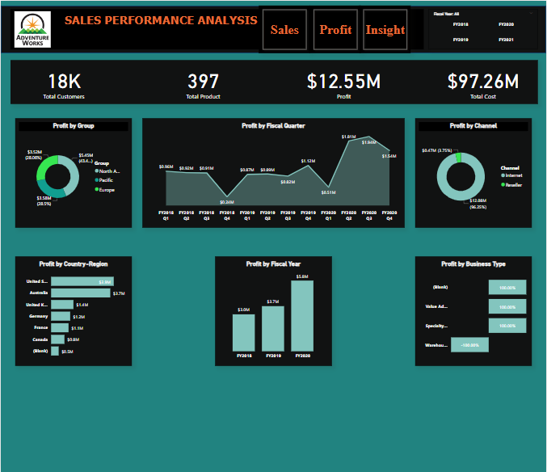
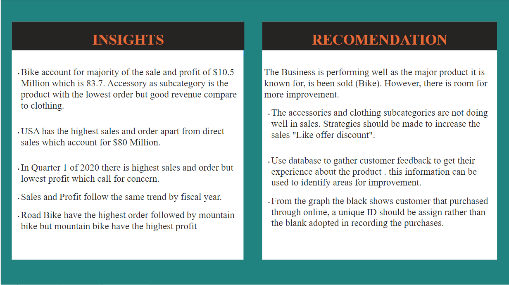

# Sales-Performance-Analysis

This project demonstrates my data analysis skills using PowerBI.

## Introduction
This is a review of AdventureWorks DW's sales results. Data from various tables in the AdventureWorksDW dataset is analyzed. PowerBI was used to conduct the analysis.
the dataset consists of seven Tables, namely
1. Sales Order Data
2. Sales Territory Data
3. Sales Data
4. Reseller Data
5. Date Data
6. Product Data
7. Customer Data

## Problem Statement
1. Determine the product's current market demand and how it changes by area.
2. Determine what has to be done to enhance the areas where sales performance is lacking.
3. To determine which products or target markets have the biggest influence on sales success.
4. to develop data-driven strategies that would help boost sales, make consumers happier, and promote business growth.

## Skill Demonstrated
1. Developing KPIs for important performance and other business calculations.
2. creating DAX formulas that can handle text and numbers.
3. Data Modelling
4. Measures Calculations
5. Fillters
6. Page buttons
7. Data Visualization

## Data Transformation/Modelling

Rows with missing values were identified and was excluded from the dataset the relationship were created between the data by joing all the tables with sales table using primary and foreign keys from the data

## Data Analysis and Visualization
To get to the target KPI, several expressions were made. I found a report with three pages that was named.
1. Sales and Order Page
2. Profit Page
3. Insigth Page

## Characteristics of the Report
The first page is named Sales Page and it contained information about the sales and order. The page has a page navigation to help navigate to other page. The secon Page contain informatio abouth the profit and loss while the third page contain insight generating from the analysis
- Sale Page

     

- Profit Page

 
     

- Insight Page

     

  
 ## You can interact with the report 

 ## Analysis
 - For the period reviewed the business generated a profit of about $12.55M wit 96% coming from internet channel while only %4 was from Resellers. 
 - Positive trends show that sales are rising and getting better every year.
 - The blank which shows direct sales or online sales as the higest sales follow by United State.
 - In Quarter 1 of 2020 there is highest sales and order but lowest profit which call for concern.
 - Road Bike have the highest order followed by mountain bike but mountain bike have the highest profit
 - Positive trends show that profit are also rising and getting better every year.
 - Road Bike have the highest order followed by mountain bike but mountain bike have the highest profit
 - The bad performance of Resellers in Sales area needs urgent attention

## Recomendation
The Business is performing well as the major product it is known for, is been sold (Bike). However, there is room for more improvement.

 - The accessories and clothing subcategories are not doing well in sales. Strategies should be made to increase the sales "Like offer discount".
 - Use database to gather customer feedback to get their experience about the product . this information can be used to identify areas for improvement.
 - From the graph the black shows customer that purchased through online, a unique ID should be assign rather than the blank adopted in recording the purchases.
 - Further Analysis needs to be carried out to know the reason why resellers are paerforming bad

   ## Thank you for reading.
   
   

